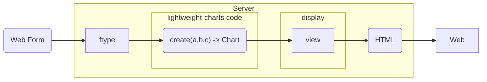
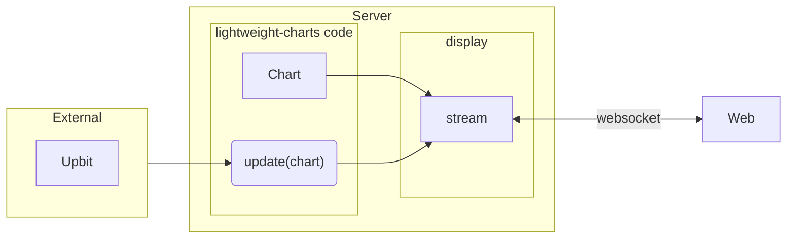

## lightweight-charts-server

[lightweight-charts-python](https://github.com/louisnw01/lightweight-charts-python) based chart hosting library

### Installation

```
pip install --upgrade lightweight-charts-server
```


### Examples

Examples of usage are in [examples/](examples/)

**Get examples through git clone**
```
git clone https://github.com/vegaxholdings/lightweight-charts-server.git

cd lightweight-charts-server

pip install -r requirements.txt
```

**Run Examples**
1. `python -m examples.1_setting_data.setting_data`  
2. `python -m examples.2_live_data.live_data`  
3. `python -m examples.3_tick_data.tick_data`  
4. `python -m examples.4_line_indicators.line_indicators`  
5. `python -m examples.5_styling.styling`  

# Advanced

There are two types of Display: View and Stream.

View can receive values ​​through HTML Form and reflect them on the chart.

Stream can receive values ​​from outside and update the chart in real time.

## View



This code demonstrates how to interact with a Form through ftype.

```python
from datetime import timedelta

from lightweight_charts import Chart
from lightweight_charts_server import ftype, View, Server

intervals = ftype.options("1m", "15m")

def create(
    option: intervals = intervals("15m"),
    color: ftype.Color = ftype.Color("#1B2E00"),
    boolean: ftype.Bool = ftype.Bool(False),
    num_int: ftype.Int = ftype.Int(14),  
    num_float: ftype.Int = ftype.Float(3.14),  
    string: ftype.Str = ftype.Str("apple"),  
    time: ftype.DateTime = ftype.DateTime.now() - timedelta(days=10),  
    df: ftype.DataFrame = ftype.DataFrame({"a": [], "b": [], "c": []}),
    config: ftype.JSON = ftype.JSON([1, 2, 3]),
) -> Chart:

    option.selected # -> str
    color.hex # -> str
    boolean.value # -> bool

    num_int # -> int
    num_float # -> float
    string # -> str
    time # -> datetime

    df # -> DataFrame
    config.obj # -> list or dict

    ...

    return chart

display = View(callback=create)
server = Server(display)

if __name__ == "__main__":
    server.serve()

```

## Stream



This code streams prices in real time through the upbit exchange.

```python
import time
from datetime import date, datetime, timedelta

import pyupbit
import pandas as pd
from lightweight_charts import Chart
from lightweight_charts_server import Stream, Server

TICKER = "KRW-XRP"

init_df = pyupbit.get_ohlcv(ticker=TICKER, interval="minute")


def update(chart: Chart):
    while True:
        update_df = pyupbit.get_ohlcv(ticker=TICKER, count=1, interval="minute")
        tick = pd.Series(
            {
                "time": date.today().isoformat(), 
                "price": update_df.iloc[0]["close"],
            }
        )
        chart.update_from_tick(tick)
        time.sleep(0.1)


chart = Chart(toolbox=True)
chart.set(init_df)

display = Stream(chart, callback=update)
server = Server(display)

if __name__ == "__main__":
    server.serve()
```